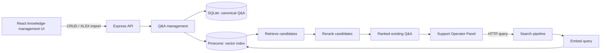

# Assist Craft Q&A

> **Semantic retrieval component for the [AI Support Platform](https://github.com/laser54/support_operator_panel).** It manages a curated Q&A knowledge base, retrieves candidates by meaning, reranks them, and returns existing approved material to an operator workflow. It does **not** generate answers.

## Case overview

**Problem.** A support workflow needs a maintainable knowledge source and relevant operator suggestions without turning unverified text into an answer.

**Workflow.** Q&A management → SQLite canonical records → embeddings and vector retrieval → reranking → ranked existing Q&A for the connected operator panel.

**My contribution.** I designed and built the Q&A-management, semantic retrieval, reranking, and React/Express integration workflow. The related [Support Operator Panel](https://github.com/laser54/support_operator_panel) owns the operator-facing FastAPI/PostgreSQL workflow; the repositories deliberately use different stacks and together form one case.

**Status and boundaries.** This is a functional prototype and retrieval component, not a claim of a corporate production deployment, measured search quality, or current customer use. Use synthetic or properly authorized data only. Session authentication and environment configuration are implementation mechanisms, not a security certification.


## Architecture



### Behaviour that is explicit in the code

- Q&A pairs can be created, updated, imported from XLSX, and synchronized to the vector index.
- Search embeds the query, retrieves a configurable candidate set, then reranks candidates when a rerank model is configured.
- A very low top rerank score is treated as **no relevant answer**; the response exposes the pipeline state and, where applicable, vector candidates rather than fabricating an answer.
- If reranking is unavailable or fails, the API records the fallback reason. This is graceful retrieval degradation, not proof of search accuracy.

## Stack

| Area | Implementation |
| --- | --- |
| Knowledge-management UI | React, TypeScript, Vite, Tailwind/shadcn-ui |
| API and validation | Node.js, Express, TypeScript, Zod |
| Canonical store | SQLite via `better-sqlite3` |
| Retrieval | Pinecone embeddings, vector retrieval, optional reranking |
| Integration | HTTP API consumed by `support_operator_panel` |
| Delivery | Docker Compose and a GitHub Actions deploy workflow |

## Quick start

### Prerequisites

- Node.js 20+
- npm 9+
- A Pinecone account and an index compatible with the configured embedding model

### Local setup

```bash
git clone https://github.com/laser54/assist-craft-qna.git
cd assist-craft-qna
npm install

cp server/example.env server/.env
# Set a unique PORTAL_PASSWORD and SESSION_SECRET.
# Add Pinecone credentials and index settings only for a retrieval-enabled run.
npm run dev
```

The frontend starts on `http://localhost:5173`; the API starts on `http://localhost:8080` by default. The SQLite file is created locally at the configured `SQLITE_PATH`.

> Do not commit `server/.env`, API keys, session secrets, exported Q&A containing real support data, or shared demo credentials.

## API surface

| Endpoint | Purpose |
| --- | --- |
| `POST /api/auth/login`, `POST /api/auth/logout` | Session lifecycle |
| `GET/POST/PUT/DELETE /api/qa` | Manage Q&A records |
| `POST /api/qa/resync` | Rebuild vector synchronization for Q&A records |
| `GET /api/search?query=...` | Retrieve and optionally rerank Q&A candidates |
| `GET /api/metrics`, `GET/PUT /api/settings` | Inspect and configure the prototype |

## Development

```bash
# Start both applications
npm run dev

# Build each workspace
npm run build --workspace frontend
npm run build --workspace server

# Lint the frontend
npm run lint --workspace frontend
```

The repository currently has no automated test suite. A successful deployment workflow builds and deploys containers; it is not an application-quality or retrieval-evaluation result.

## License

ISC
