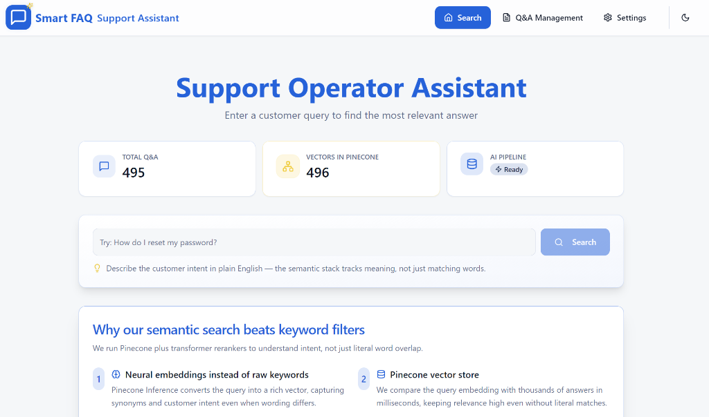
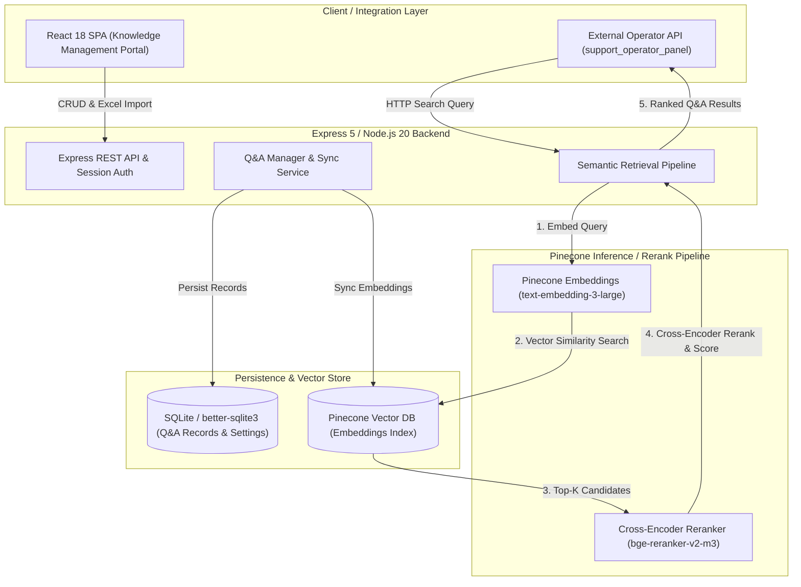

# Smart FAQ — semantic retrieval and reranking component

> A public knowledge-base component for the [AI Support Platform](https://github.com/laser54/support_operator_panel): it stores Q&A content, retrieves semantically related candidates, and reranks them for an operator-facing workflow. It does not generate answers.

**Status:** functional prototype / retrieval component, not a production-service claim. Use only synthetic or properly authorized data.

**My contribution:** I built the product and engineering workflow around Q&A management, semantic retrieval, reranking, and the React/Express integration. The related [Support Operator Panel](https://github.com/laser54/support_operator_panel) provides the operator UI and FastAPI/PostgreSQL context; the repositories intentionally use different stacks.

**Workflow:** Q&A content → embeddings → vector retrieval → reranking → ranked candidates for the support workflow.

[](https://www.typescriptlang.org/)
[](https://reactjs.org/)
[](https://nodejs.org/)
[](https://www.pinecone.io/)


## ✨ Features

- **🔍 Semantic retrieval**: vector-similarity retrieval powered by Pinecone
- **🎯 Reranking**: transformer-based reranking of retrieved candidates
- **📊 Modern UI**: Beautiful, responsive interface built with shadcn/ui and Tailwind CSS
- **📝 Q&A Management**: Full CRUD operations with bulk Excel import/export
- **🌐 Multi-language Support**: Optimized embeddings for query and passage types
- **🔐 Secure Authentication**: Session-based access control
- **⚡ Real-time Updates**: Live metrics and instant search results
- **📱 Mobile-First**: Fully responsive design for all devices

## 🛠️ Tech Stack

### Frontend
- **⚛️ React 18** - Modern UI library with hooks and concurrent features
- **📘 TypeScript** - Type-safe development with excellent IDE support
- **⚡ Vite** - Next-generation frontend tooling with instant HMR
- **🎨 Tailwind CSS** - Utility-first CSS framework for rapid UI development
- **🧩 shadcn/ui** - High-quality, accessible component library built on Radix UI
- **🔄 React Query** - Powerful data synchronization and caching
- **🗺️ React Router** - Declarative routing for single-page applications
- **📊 Recharts** - Composable charting library built on React components

**Why these technologies?**
- **React + TypeScript**: Industry-standard combination providing type safety, excellent tooling, and massive ecosystem
- **Vite**: 10-100x faster than Webpack, instant server start, and optimized production builds
- **Tailwind CSS**: Write styles faster, maintain consistency, and build responsive UIs without leaving HTML
- **shadcn/ui**: Copy-paste components you own, fully customizable, accessible by default
- **React Query**: Eliminates boilerplate for data fetching, caching, synchronization, and background updates

### Backend
- **🟢 Node.js 20** - JavaScript runtime built on Chrome's V8 engine
- **🚀 Express 5** - Fast, unopinionated web framework for Node.js
- **📘 TypeScript** - End-to-end type safety across the stack
- **🗄️ SQLite (better-sqlite3)** - Zero-configuration database, perfect for embedded applications
- **🔍 Pinecone** - managed vector database used for embeddings, retrieval, and reranking
- **✅ Zod** - TypeScript-first schema validation with static type inference
- **📝 Pino** - Extremely fast logger with structured JSON output

**Why these technologies?**
- **Express**: Minimal, flexible, battle-tested framework with massive middleware ecosystem
- **SQLite**: Perfect for applications needing reliable, file-based storage without database server overhead
- **Pinecone**: Production-ready vector DB with managed infrastructure, automatic scaling, and optimized performance
- **Zod**: Catch errors at runtime AND compile-time, eliminates duplicate type definitions
- **better-sqlite3**: Fastest SQLite binding for Node.js, synchronous API perfect for server-side operations

### AI/ML
- **🧠 Pinecone Embeddings** - State-of-the-art embedding models (e.g., `text-embedding-3-large`)
- **🎯 Pinecone Reranker** - Transformer-based reranking models (e.g., `bge-reranker-v2-m3`)
- **📊 Semantic Search** - Query-aware embeddings optimized for search vs. document storage

**Why Pinecone here?**
- **Unified API**: embeddings, vector storage, retrieval, and reranking are available through one service.
- **Retrieval workflow fit**: query and passage embeddings can be configured separately, then reranked for relevance.
- **Boundary**: provider capabilities and service-level claims are not performance measurements of this prototype.

## 🏗️ Architecture



### Key Design Decisions

- **Monorepo Structure**: Shared TypeScript configs, single dependency management, easier refactoring
- **RESTful API**: Standard HTTP methods, predictable endpoints, easy to test and integrate
- **Session-based Auth**: Simple, secure, no JWT complexity for single-server deployments
- **Vector Search Pipeline**: Embed → Search → Rerank for optimal relevance
- **Retry Logic**: Automatic retries for Pinecone operations with exponential backoff

## 🚀 Quick Start

### Prerequisites

- **Node.js** 20+ ([install with nvm](https://github.com/nvm-sh/nvm#installing-and-updating))
- **npm** 9+ (comes with Node.js)
- **Pinecone Account** ([sign up for free](https://www.pinecone.io/))

### Installation

1. **Clone the repository**
```bash
git clone <YOUR_GIT_URL>
cd assist-craft-qna
```

2. **Install dependencies**
```bash
npm install
```

3. **Configure environment variables**

Copy the example environment file:
```bash
cp server/example.env server/.env
```

Edit `server/.env` with your configuration:
```env
PORT=8080
NODE_ENV=development
PORTAL_PASSWORD=your-secure-password-here
SESSION_SECRET=your-random-session-secret
SESSION_TTL_SECONDS=43200
SQLITE_PATH=./data/app.db

# Pinecone Configuration
PINECONE_API_KEY=your-pinecone-api-key
PINECONE_INDEX=your-index-name
PINECONE_HOST=https://your-index.svc.environment.pinecone.io
PINECONE_EMBED_MODEL=text-embedding-3-large
PINECONE_RERANK_MODEL=bge-reranker-v2-m3
PINECONE_RERANK_DAILY_LIMIT=500
PINECONE_NAMESPACE=qa
CSV_BATCH_SIZE=25
```

4. **Start the development server**
```bash
npm run dev
```

This will start both frontend and backend servers:
- **Frontend**: http://localhost:5173
- **Backend API**: http://localhost:8080

**Note:** The SQLite database will be created automatically on first run in `server/data/app.db`. Database files are excluded from git via `.gitignore` to keep your data private.

### First Steps

1. Open http://localhost:5173 in your browser
2. Login with the password from `PORTAL_PASSWORD` in your `.env` file
3. Add your first Q&A pair or import an Excel file
4. Start searching!

## 📖 Usage

### Adding Q&A Pairs

**Manual Entry:**
- Navigate to "Q&A Management"
- Click "Add New Q&A"
- Enter question and answer
- Save (automatically synced to Pinecone)

**Bulk Import:**
- Use the Excel import feature
- Upload an XLSX file with the following column headers: `question`, `answer`, `language` (optional)
- Supports batch processing with configurable chunk size
- Example structure:
  | question | answer | language |
  |----------|--------|----------|
  | What is AI? | Artificial Intelligence... | en |
  | Что такое ИИ? | Искусственный интеллект... | ru |

### Searching

- Enter your query in the search box
- Results are automatically:
  1. Embedded using query-optimized embeddings
  2. Retrieved via vector similarity search
  3. Reranked by semantic relevance
- Top result displayed prominently with confidence indicators

### Settings

- Configure embedding and rerank models (read-only, set via environment)
- Toggle reranker on/off
- View system metrics

## 🧪 Development

### Project Structure

```
assist-craft-qna/
├── frontend/          # React + Vite application
│   ├── src/
│   │   ├── components/  # Reusable UI components
│   │   ├── pages/       # Route pages
│   │   ├── hooks/       # Custom React hooks
│   │   └── lib/         # Utilities and API client
│   └── package.json
├── server/            # Express + TypeScript backend
│   ├── src/
│   │   ├── routes/      # API route handlers
│   │   ├── services/    # Business logic
│   │   ├── middleware/  # Express middleware
│   │   └── lib/         # Utilities and config
│   └── package.json
└── package.json       # Root workspace config
```

### Available Scripts

```bash
# Start both frontend and backend
npm run dev

# Start only backend
npm run dev:server

# Start only frontend
npm run dev:frontend

# Build for production
npm run build --workspace frontend
npm run build --workspace server
```

### API Endpoints

- `POST /api/auth/login` - Authenticate user
- `POST /api/auth/logout` - End session
- `GET /api/qa` - List Q&A pairs (paginated)
- `POST /api/qa` - Create new Q&A pair
- `PUT /api/qa/:id` - Update Q&A pair
- `DELETE /api/qa/:id` - Delete Q&A pair
- `POST /api/qa/import` - Bulk import from Excel (XLSX)
- `GET /api/search?query=...` - Semantic search
- `GET /api/metrics` - System statistics
- `GET /api/settings` - Get settings
- `PUT /api/settings` - Update settings


## 📝 License

ISC

## 🤝 Contributing

Contributions are welcome! Please feel free to submit a Pull Request.

---

**Built with ❤️ using open-source technologies**
.
